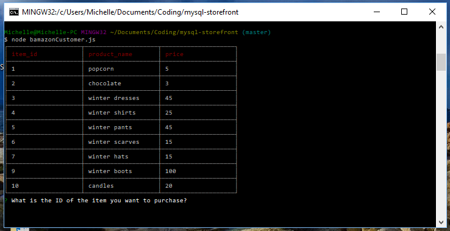
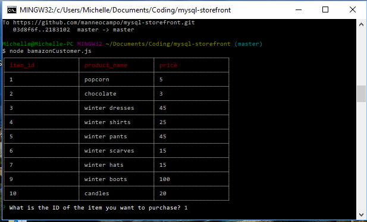
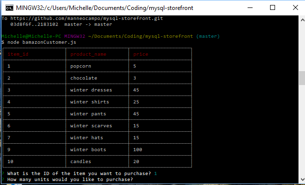
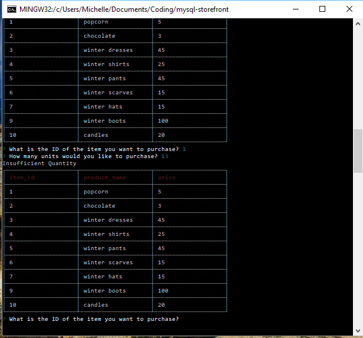
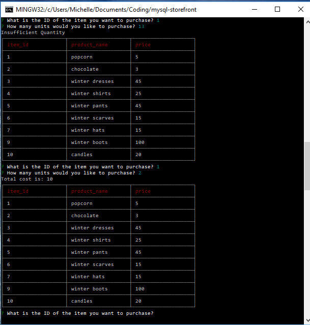

# mysql-storefront
Overview: 
This project incorporates working with databases by using MySQL and SQL queries. 

This project creates an Amazon-like storefront with MySQL. The app takes in orders from the customers and depletes stock from the store's inventory. The screenshots below show the CLI app in use. 

This project utilizes mysql, inquirer, and cli-table2 npm packages. 

***

***

***

***

